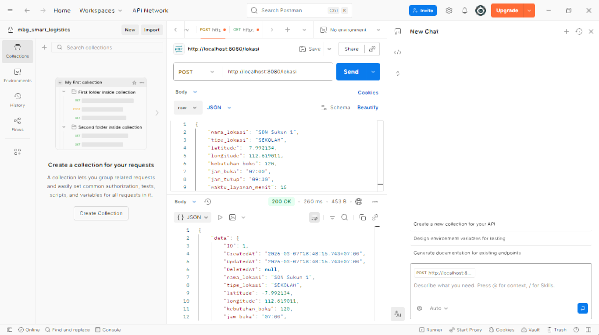
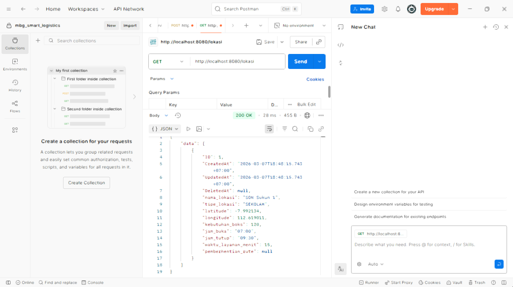

# Tugas REST API - MBG Smart Logistics

Proyek ini adalah tugas pembuatan REST API dasar menggunakan Golang. Fungsionalitas saat ini fokus pada proses input dan pengambilan data lokasi.

## Langkah Pengerjaan dan Cara Install

1. **Persiapan Database:**
   
   * **Jika menggunakan Laragon:**
     * Buka aplikasi Laragon, lalu klik tombol **Start All** untuk menyalakan Apache dan MySQL. (Perhatikan port MySQL yang aktif, biasanya 3306 atau 3308).
   * **Jika menggunakan XAMPP:**
     * Buka aplikasi XAMPP Control Panel.
     * Klik tombol **Start** pada modul **Apache** dan **MySQL**. (Secara default MySQL berjalan di port 3306).
   
   * **Membuat Struktur Database:**
     * Buka browser dan akses phpMyAdmin melalui `http://localhost/phpmyadmin`.
     * Buat database baru dengan nama `mbg_smart_logistics`.
     * Lakukan *Import* file `database_schema.sql` (yang tersedia di repositori ini) untuk membuat tabel `pengguna`, `lokasi`, `rute`, dan `pemberhentian_rute`.

2. **Konfigurasi Proyek Golang:**
   * Buka terminal di folder proyek.
   * Unduh library yang dibutuhkan dengan perintah:
     `go mod tidy`
   * Buka file `main.go`, pastikan port database (DSN) sudah sesuai dengan port MySQL yang menyala di komputer Anda (contoh menggunakan port 3308):
     `dsn := "root:@tcp(localhost:3308)/mbg_smart_logistics?charset=utf8mb4&parseTime=True&loc=Local"`

3. **Menjalankan Server:**
   * Di terminal, jalankan perintah:
     `go run main.go`
   * Server akan berjalan di `http://localhost:8080`.

---

## Dokumentasi API

Fokus pada tugas ini adalah endpoint untuk menambahkan dan melihat data lokasi.

### 1. Tambah Data Lokasi
* **URL Endpoint:** `http://localhost:8080/lokasi`
* **Method:** `POST`
* **Format Body (raw -> JSON):**
```json
{
    "nama_lokasi": "SDN Sukun 1",
    "tipe_lokasi": "SEKOLAH",
    "latitude": -7.992134,
    "longitude": 112.619011,
    "kebutuhan_boks": 120,
    "jam_buka": "07:00",
    "jam_tutup": "09:30",
    "waktu_layanan_menit": 15
}
```
* **Contoh Hasil Uji Coba (Postman):**


### 2. Lihat Data Lokasi
* **URL Endpoint:** `http://localhost:8080/lokasi`
* **Method:** `GET`
* **Parameter:** Tidak ada parameter tambahan.
* **Contoh Hasil Uji Coba (Postman):**
